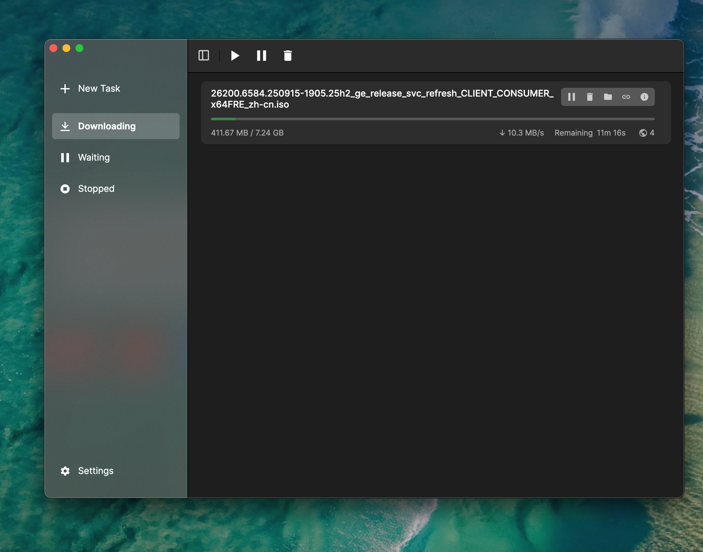
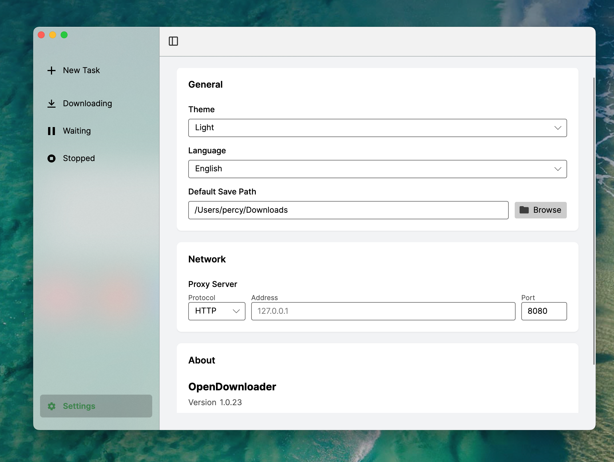

## Downio

<div align="center">


### A Modern Download Manager for macOS, Windows, and Linux

[](https://github.com/pengpercy/Downio/releases)
[](LICENSE)
[](https://github.com/pengpercy/Downio/actions)

[简体中文](README_zh-CN.md) | [English](README.md)

</div>

## Screenshots

<div align="center">
  
  
</div>

## Features

- 🚀 **High Performance**: Powered by the robust `aria2` engine, supporting multi-threaded downloads.
- 🎨 **Modern UI**: Clean, beautiful interface built with Avalonia UI, following fluent design principles.
- 🖥️ **Cross-Platform**: Native support for macOS (Universal), Windows, and Linux.
- 🌐 **Advanced Network**: Full HTTP/HTTPS and SOCKS5 proxy support.
- 🌗 **Theme System**: Seamless switching between Light and Dark modes.
- 🌍 **Internationalization**: Built-in English and Chinese (Simplified) support.
- 📋 **Clipboard Monitor**: Automatically detects download links (Coming soon).

## Installation

### macOS
Download the `.dmg` file from [Releases](https://github.com/pengpercy/Downio/releases), drag and drop to Applications folder.

### Windows
Download the `.zip` file, extract and run `Downio.exe`.

### Linux
Prefer the `.AppImage` (easiest). Make it executable and run:
```bash
chmod +x Downio*.AppImage
./Downio*.AppImage
```
You can also install via `.deb` / `.rpm` for your distro.

## Development

**Prerequisites:**
- .NET 10.0 SDK
- Avalonia templates

**Build:**
```bash
dotnet build src/Downio/Downio.csproj
```

**Run:**
```bash
dotnet run --project src/Downio/Downio.csproj
```

### Building for macOS

Use the provided script to package for macOS (creates a .dmg):

```bash
chmod +x build/package_osx.sh
./build/package_osx.sh osx-x64 1.0.0 build_output/
```

## License

MIT License. See [LICENSE](LICENSE) file for details.

---
<div align="center">
  <sub>Built with ❤️ using <a href="https://avaloniaui.net/">Avalonia UI</a></sub>
</div>
