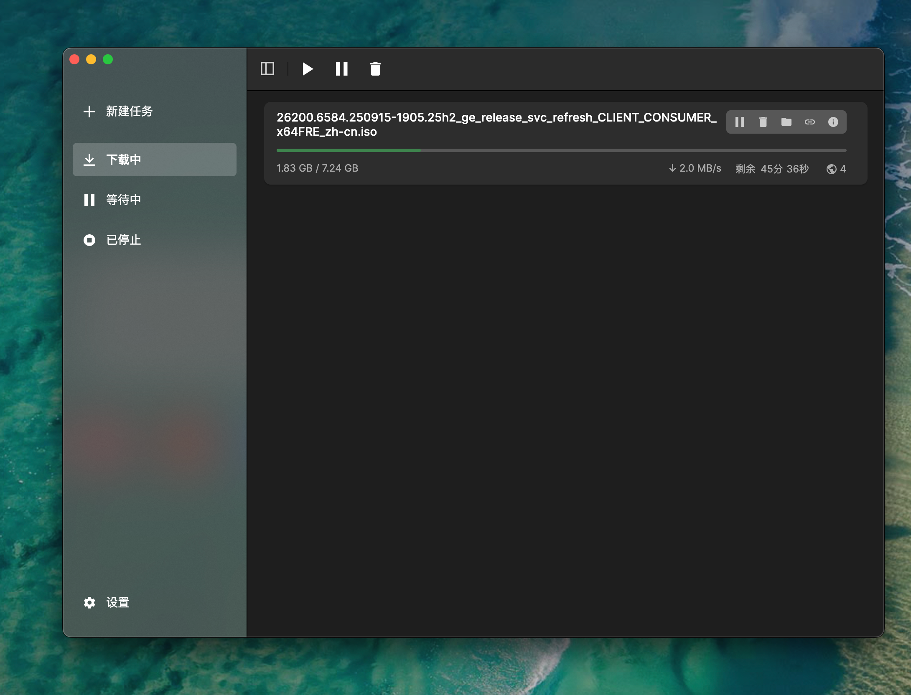
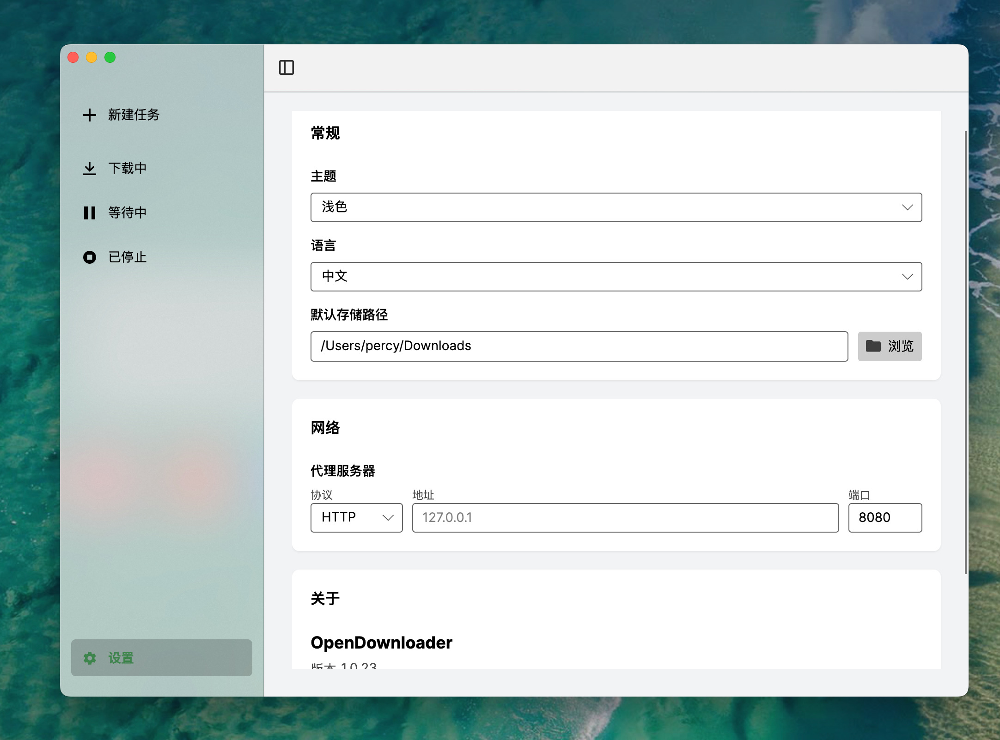

## Downio

<div align="center">


### 适用于 macOS、Windows 和 Linux 的现代化下载管理器

[](https://github.com/pengpercy/Downio/releases)
[](LICENSE)
[](https://github.com/pengpercy/Downio/actions)

[English](README.md) | [简体中文](README_zh-CN.md)

</div>

## 界面预览

<div align="center">
  
  
</div>

## ✨ 核心特性

- 🚀 **极致性能**：基于强大的 `aria2` 引擎，支持多线程极速下载。
- 🎨 **现代设计**：采用 Avalonia UI 构建，遵循流畅设计（Fluent Design）原则，界面清爽美观。
- 🖥️ **全平台支持**：完美支持 macOS (Universal)、Windows 和 Linux 原生运行。
- 🌐 **网络增强**：完整的 HTTP/HTTPS 和 SOCKS5 代理支持。
- 🌗 **主题系统**：内置亮色与深色模式，随心切换。
- 🌍 **多语言**：原生支持简体中文和英文。
- 📋 **剪贴板监听**：自动检测下载链接（即将推出）。

## 📥 安装指南

### macOS
从 [Releases](https://github.com/pengpercy/Downio/releases) 下载 `.dmg` 文件，将应用拖入“应用程序”文件夹即可。

如果出现 “Downio 已损坏，无法打开。你应该将它移到废纸篓。”：
- 右键点击应用 → “打开”（首次需要这样做一次）
- 或进入 “系统设置” → “隐私与安全性”，在底部找到被拦截的提示，点 “仍要打开”
- 仍不行时（高级方式）：在终端执行 `xattr -dr com.apple.quarantine /Applications/Downio.app`

### Windows
下载 `.zip` 压缩包，解压后运行 `Downio.exe`。

### Linux
优先下载 `.AppImage`（最简单），赋予执行权限后运行：
```bash
chmod +x Downio*.AppImage
./Downio*.AppImage
```
也可以使用发行版对应的 `.deb` / `.rpm` 包安装。

## 🛠️ 开发指南

**环境要求：**
- .NET 10.0 SDK
- Avalonia 模板

**构建项目：**
```bash
dotnet build src/Downio/Downio.csproj
```

**运行项目：**
```bash
dotnet run --project src/Downio/Downio.csproj
```

### 📦 macOS 打包

使用提供的脚本打包 macOS 应用（生成 .dmg 文件）：

```bash
chmod +x build/package_osx.sh
./build/package_osx.sh osx-x64 1.0.0 build_output/
```

## 📄 许可证

MIT License. 详见 [LICENSE](LICENSE) 文件。

---
<div align="center">
  <sub>Built with ❤️ using <a href="https://avaloniaui.net/">Avalonia UI</a></sub>
</div>
